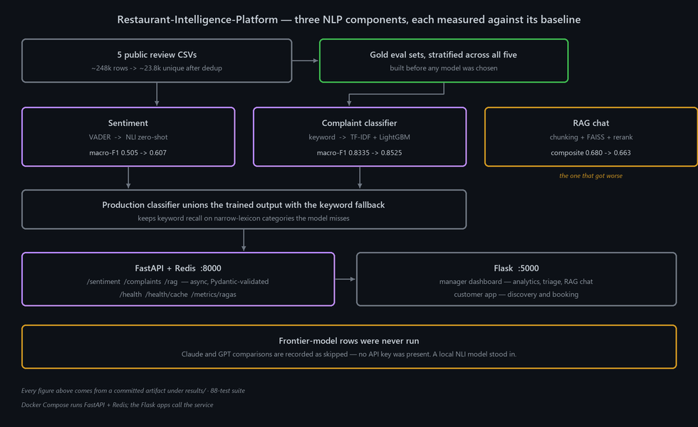

# Restaurant-Intelligence-Platform

A restaurant analytics platform with two front ends: a **manager dashboard** for reviewing customer feedback — sentiment trends, complaint triage, and a RAG chat that answers questions over the reviews — and a **customer app** for discovery and booking. Behind both sits a FastAPI + Redis service exposing three NLP components.

Each of those three components was measured against the simplest thing that could work, on gold eval sets built before any model was chosen. Two of the three improved. One got worse, and it's reported below.

---

## Architecture



---

## Measured results

### Complaint classifier — the keyword baseline is hard to beat

Multi-label, 8 categories, fresh 100-review holdout:

| Layer | Approach | macro-F1 | Subset accuracy | Fit time |
|---|---|---:|---:|---:|
| L0 | keyword substring scan | 0.8335 | 0.39 | 0 s |
| L1 | TF-IDF + logistic regression | 0.4859 | 0.11 | 1.7 s |
| L2 | TF-IDF + LightGBM (default) | 0.6566 | 0.29 | 22.4 s |
| **L3** | **TF-IDF + LightGBM (Optuna-tuned)** | **0.8525** | **0.46** | 15.0 s |
| L4 | L3 + per-class thresholds | 0.8502 | 0.43 | 15.0 s |
| L5 | logreg BCE + per-class thresholds | 0.1980 | 0.03 | 1.5 s |

The honest reading: **the tuned model beats the keyword scan by only +0.019 macro-F1**, and three of the five learned variants are *far worse* than the substring baseline. What the model actually buys is subset accuracy — 0.46 vs 0.39, getting *all* labels on a review right.

That is why production **unions** the trained output with the keyword fallback: the keyword scan still wins on narrow-lexicon categories.

Source: [`results/ablation.csv`](results/ablation.csv)

### Sentiment — VADER collapses on the neutral class

200-review gold set:

| Engine | macro-F1 | Accuracy |
|---|---:|---:|
| VADER (originally shipped) | 0.5045 | 0.58 |
| DistilBERT SST-2 | 0.5599 | 0.65 |
| **NLI zero-shot (champion)** | **0.6069** | **0.68** |

The baseline's failure is specific: VADER scored **F1 0.081 on Neutral** — recall 0.045 — because lexicon scoring pushes almost everything to positive or negative. NLI entailment recovers that class.

Source: [`results/baseline_metrics.json`](results/baseline_metrics.json) · [`results/frontier_comparison.csv`](results/frontier_comparison.csv)

### RAG — the component that got worse

| Config | Structural composite |
|---|---:|
| Template synthesis (baseline) | **0.6802** |
| flan-t5 + rerank over existing chunks | 0.6628 |

On the structural composite the LLM-backed pipeline **scores 0.017 lower than templates**. Templates always emit a rating and top terms, which the structural metric rewards. It is kept for the qualitative answers it produces, not because it won the benchmark.

Source: [`results/frontier_comparison.csv`](results/frontier_comparison.csv)

> **The frontier-model comparison was never run.** `frontier_comparison.csv` records the `claude_opus_4_6` and `gpt_5_4` rows for all three components as **skipped — "API key not present in autonomous run; deferred."** A local `distilbart-mnli` zero-shot model was used as a *stand-in*, and it scores macro-F1 0.4844 on complaints. Any figure elsewhere describing that number as a frontier-model result is a misattribution — it is a local NLI model.

---

## How it works

1. **Ingest** five public review CSVs, deduplicate to ~23.8k unique reviews.
2. **Build gold eval sets** stratified across all five sources — done before choosing any model, so nothing is selected on the test set.
3. **Sentiment** — an NLI zero-shot model classifies positive/neutral/negative, with VADER retained as a fallback.
4. **Complaints** — TF-IDF features into a one-vs-rest LightGBM with eight binary heads, tuned by a 30-trial Optuna sweep. The output is unioned with the keyword scan.
5. **RAG** — reviews are chunked, embedded into FAISS, reranked with `ms-marco-MiniLM-L-6-v2`, and answered by flan-t5. Repeat queries are served from the Redis cache.
6. **Serve** all three over FastAPI with Pydantic validation; both Flask apps call the service rather than importing the models.

## Infrastructure

| Layer | Technology |
|---|---|
| Sentiment | `valhalla/distilbart-mnli-12-3` · VADER fallback |
| Complaints | TF-IDF + LightGBM (one-vs-rest) · Optuna |
| RAG | FAISS · `ms-marco-MiniLM-L-6-v2` reranker · flan-t5 |
| API | FastAPI (async, Pydantic) |
| Cache | Redis |
| Front ends | Flask — manager dashboard + customer app |
| Packaging | Docker Compose |
| Tests | 88 |

---

## Quick start

```bash
# Production stack (FastAPI + Redis) via Docker
docker compose up -d
curl http://localhost:8000/health

# Flask UI (manager + customer) — separate terminal
pip install -r requirements.txt
python app.py                       # http://localhost:5000

# FastAPI service standalone (no Docker)
pip install -r requirements-api.txt
uvicorn api:app --port 8000 --reload

# Tests
python -m pytest tests/ -v
```

Regenerate the architecture diagram with `python assets/make_architecture.py`.

## API

`POST /sentiment` · `POST /complaints` · `POST /rag` — all async, Pydantic-validated.
`GET /health`, `GET /health/cache`, `GET /metrics/ragas` — liveness plus live RAGAS-proxy means and latency percentiles.

---

## Datasets

Five public review CSVs in `datasets/` (~248k rows, ~23.8k unique after dedup): `zomato.csv`, `zomato2.csv`, `mumbaires.csv`, `Resreviews.csv`, `reviews.csv`. Eval sets are sampled stratified across all five.

---

## License

MIT. See [LICENSE](LICENSE).
