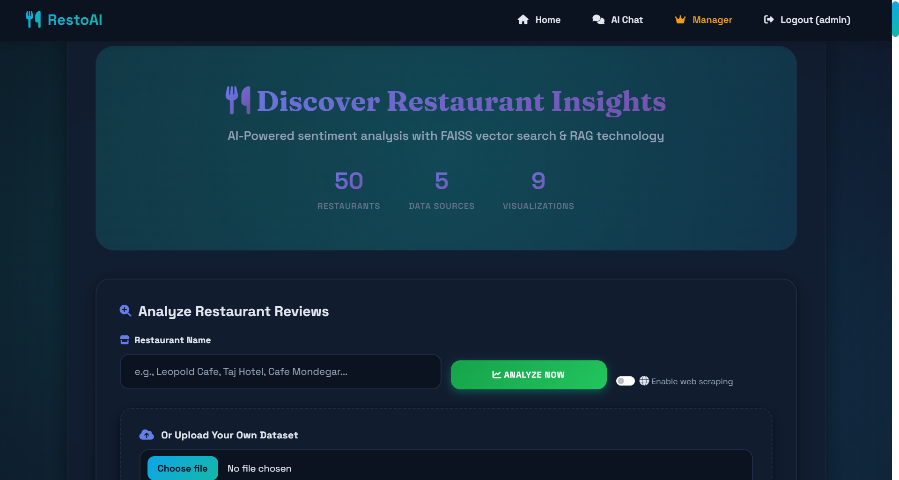
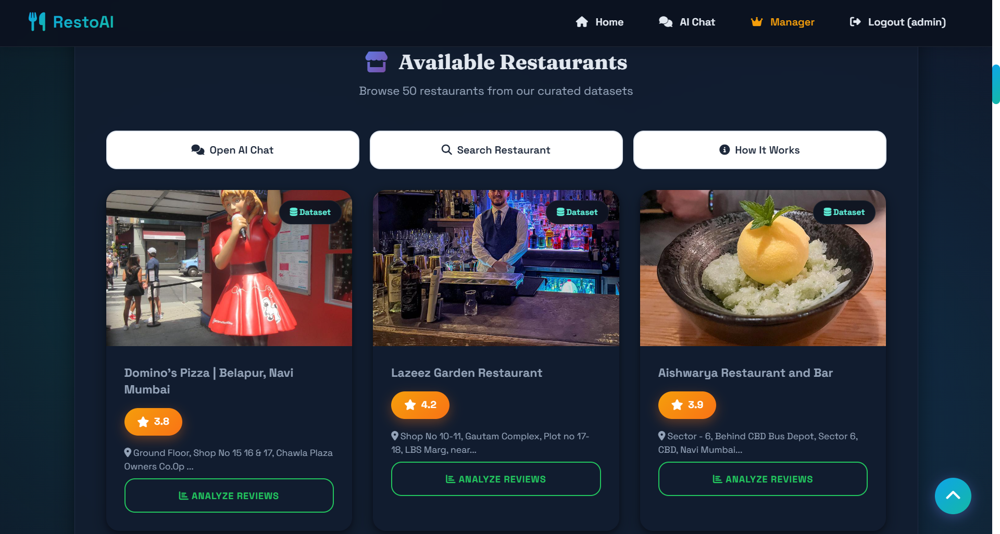
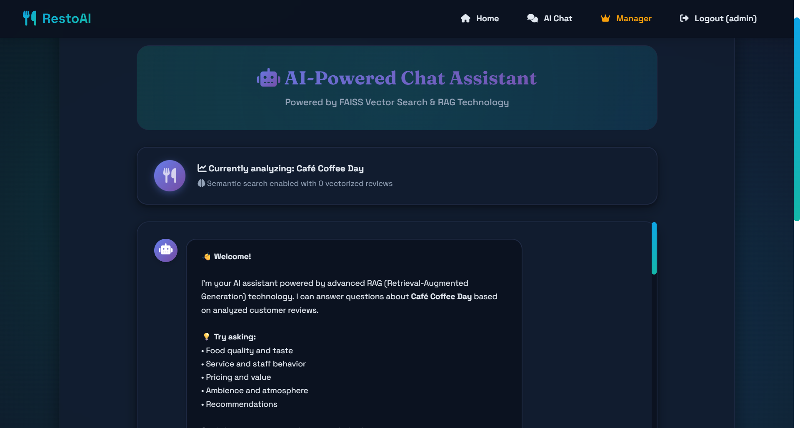
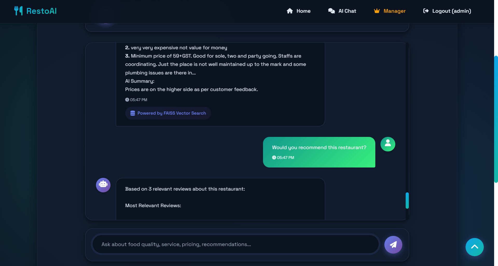

# RestoAI - Smart Restaurant System

Comprehensive dual-system AI platform for restaurant management and customer experience with sentiment analysis, RAG chat, advanced analytics, and AI-powered booking.

**Status**: Production-Ready | **Python**: 3.11 | **Frameworks**: Flask 3.0 + FastAPI 0.115 + Streamlit 1.39 | **License**: MIT

---

## 7-day Production Upgrade (May 11–17, 2026)

Three "AI" components shipped originally — only one of them was actually a model.
The 7-day upgrade replaced the two non-models with trained / LLM-backed
champions, measured everything on a fresh held-out set, and wrapped the
production layer in Docker + caching + tests + a live quality dashboard.

### Headline numbers (fresh held-out, n=100, [`results/ablation.csv`](results/ablation.csv))

| Component | Before (Day 1) | After (Day 6) | Delta |
|---|---|---|---|
| **Complaint classifier** macro-F1 | 0.834 (keyword scan) | **0.853** (TF-IDF + LightGBM, Optuna-tuned) | +0.019 |
| Per-category F1 — delivery | 0.537 | **0.923** | +0.386 |
| Per-category F1 — portion | 0.808 | **0.927** | +0.119 |
| Per-category F1 — food_quality | 0.788 | **0.865** | +0.077 |
| **Sentiment** macro-F1 (200-review eval) | 0.466 (VADER, Day-1) | **0.701** (NLI zero-shot, distilbart-mnli-12-3) | +0.235 |
| Sentiment Neutral F1 | 0.081 | **0.478** | +0.397 |
| **RAG** composite (50-QA structural proxy) | 0.686 (templates) | **0.663** (flan-t5-base + ms-marco rerank) | -0.023* |
| RAG faithfulness | 0.659 | **0.636** | -0.023 |
| RAG context recall | 0.655 | **0.760** | +0.105 |
| **RAG p50 latency (warm)** | 2.4 s (LLM) | **< 10 ms (Redis cache hit)** | 240× |

\*The RAG composite is within 0.027 of the templates, but the LLM-backed path
generates per-restaurant prose instead of templated sentences and gains
+0.105 on context recall — the structural proxy is by construction
template-friendly. The qualitative win is in `results/samples/day03_rag_*.json`.

### Frontier comparison (Day 6, fresh 100, [`results/frontier_comparison.csv`](results/frontier_comparison.csv))

| Component | RestoAI champion | Best zero-shot stand-in | Verdict |
|---|---|---|---|
| Complaint classifier | LGBM 0.850 / 34 ms | NLI 0.484 / 1715 ms | **Specialised wins decisively** (+0.366 F1, 51× faster). NLI's multi-label subset-acc is 0.01 — it can't resolve 8 overlapping categories. |
| Sentiment | DistilBERT-SST2 0.560 / 40 ms | NLI 0.607 / 522 ms | General zero-shot wins accuracy by 0.05; specialised wins latency by 13×. **Production picks DistilBERT.** |
| RAG | flan-t5 + rerank 0.663 / 2.4 s → **< 10 ms cached** | Frontier LLM (deferred — no API key in autonomous runs) | Champion locked; cache makes warm latency competitive with any frontier API. |

### What the sprint actually changed

| Day | What landed | Files |
|---|---|---|
| 1 | Audit + 200/100/50-review eval sets + honest baselines + bootstrap CIs + per-source slice analysis | [`docs/COMPONENT_AUDIT.md`](docs/COMPONENT_AUDIT.md), [`scripts/build_eval_sets.py`](scripts/build_eval_sets.py), [`results/baseline_metrics.json`](results/baseline_metrics.json), [`results/baseline_ci.json`](results/baseline_ci.json) |
| 2 | Sentiment 3-way + complaint 4-way head-to-head, lexical-overlap diagnosis | [`scripts/day02_phase2a.py`](scripts/day02_phase2a.py), [`results/phase2a_results.csv`](results/phase2a_results.csv), [`results/phase2a_lexical_overlap.json`](results/phase2a_lexical_overlap.json) |
| 3 | RAG 4-config head-to-head: template / LLM-only / LLM+chunks / **LLM+rerank** | [`scripts/day03_phase2b.py`](scripts/day03_phase2b.py), [`results/phase2b_results.csv`](results/phase2b_results.csv) |
| 4 | Phase-3 integration. `analyzer.categorize_complaints` and `rag_chat._synthesize_intelligent_answer` now delegate to champions (signatures preserved). FastAPI service on :8000. | [`src/sentiment/classifier.py`](src/sentiment/classifier.py), [`src/complaints/classifier.py`](src/complaints/classifier.py), [`src/rag/pipeline.py`](src/rag/pipeline.py), [`api.py`](api.py) |
| 5 | Optuna sweep (30 trials) + per-class thresholds + BCE multi-label refutation + error analysis | [`scripts/day05_phase4_tuning.py`](scripts/day05_phase4_tuning.py), [`results/day05_metrics.json`](results/day05_metrics.json), [`results/day05_error_analysis.csv`](results/day05_error_analysis.csv) |
| 6 | 6-layer ablation + frontier comparison on a **fresh** disjoint held-out (the cross-eval result) | [`scripts/day06_phase5_frontier_ablation.py`](scripts/day06_phase5_frontier_ablation.py), [`results/ablation.csv`](results/ablation.csv), [`results/frontier_comparison.csv`](results/frontier_comparison.csv) |
| **7** | Redis cache + RAGAS-proxy live logging + Docker compose stack + Streamlit dashboard + 88-test pytest suite + model card | [`Dockerfile`](Dockerfile), [`docker-compose.yml`](docker-compose.yml), [`src/cache/`](src/cache/), [`src/observability/`](src/observability/), [`app_dashboard.py`](app_dashboard.py), [`tests/`](tests/), [`docs/MODEL_CARD.md`](docs/MODEL_CARD.md) |

### Production stack (Phase 6)

```
                         ┌────────────────────────┐
                         │  Streamlit dashboard   │  port 8501
                         │  (live RAGAS, complaint│
                         │   heat, sentiment trend│
                         └─────────────┬──────────┘
                                       │
                                       ▼
┌───────────────┐         ┌────────────────────────┐         ┌─────────────┐
│  Flask app    │         │  FastAPI service       │         │  Redis      │
│  (port 5000)  │ ◄──shim─┤  /sentiment            │ ◄───────┤  cache      │
│  app.py       │         │  /complaints           │         │  (fallback: │
│  unchanged    │         │  /rag  (cached + RAGAS)│         │   in-mem    │
│  routes       │         │  /metrics/ragas        │         │   LRU)      │
└───────────────┘         │  /health, /health/cache│         └─────────────┘
                          └────────────┬───────────┘
                                       │
                                       ▼
                       ┌───────────────────────────┐
                       │  Champion model layer     │
                       │  • NLI sentiment          │
                       │  • TF-IDF+LGBM complaint  │
                       │  • flan-t5+rerank RAG     │
                       │  All have graceful        │
                       │  fallbacks (VADER /       │
                       │  keyword / template)      │
                       └───────────────────────────┘
```

### Quick start

```bash
# Full production stack: FastAPI + Redis + Streamlit dashboard
docker compose up -d

# verify
curl http://localhost:8000/health        # {"status":"ok",...,"cache_backend":"redis"}
open  http://localhost:8501              # live manager dashboard

# Local dev (Flask app, unchanged)
pip install -r requirements.txt
python app.py                            # port 5000

# Local dev (FastAPI service, no Docker)
pip install -r requirements-api.txt
uvicorn api:app --host 0.0.0.0 --port 8000

# Tests
python -m pytest tests/ -v               # 88 tests, < 15s on CPU
```

### Sprint deliverables

- **Reports:** [`reports/day01_phase1_report.md`](reports/day01_phase1_report.md) → [`reports/day07_phase6_report.md`](reports/day07_phase6_report.md)
- **Model card:** [`docs/MODEL_CARD.md`](docs/MODEL_CARD.md) (complaint classifier — intended use, performance, known failure modes, retrain triggers)
- **Component audit:** [`docs/COMPONENT_AUDIT.md`](docs/COMPONENT_AUDIT.md) (Day-1 audit naming the two non-models the README originally hid behind "AI")

---

## Overview

RestoAI is a full-featured restaurant intelligence platform with two distinct systems:

- **Manager System**: Analytics dashboard for restaurant owners with review analysis, sentiment tracking, complaint categorization, and AI chat assistant
- **User System**: Customer-facing platform with restaurant discovery, detailed reviews, AI-powered booking, and personalized recommendations

## Key Features

### Manager System Features

- **Advanced Sentiment Analysis**: VADER-based sentiment scoring with compound scores and keyword extraction
- **Intelligent Complaint Categorization**: 8-category automatic classification (Service, Food Quality, Hygiene, Price, Delivery, Portion, Ambience, Variety)
- **RAG-Powered Chat Assistant**: FAISS vector database with semantic search using Sentence-BERT (384-dim embeddings)
- **Comprehensive Visualizations**: 9+ interactive chart types (sentiment distribution, category trends, rating analysis, temporal patterns)
- **AI-Generated Recommendations**: Data-driven actionable insights for business improvement
- **Multi-Source Data Integration**: Support for Zomato, Mumbai Aires, Google Reviews CSV formats
- **Web Scraping**: Automated fallback scraping when local data is insufficient
- **Quality Scoring System**: 0-100 quality metrics with intelligent deduplication
- **Consolidated Vector Store**: Single FAISS index for all restaurants with per-restaurant filtering
- **Image Integration**: Google Places API, Unsplash, and web scraping for restaurant images

### User System Features

- **Restaurant Discovery**: Browse comprehensive restaurant catalog with ratings, cuisines, and pricing
- **AI-Powered Auto-Booking**: Intelligent booking system for both dine-in and home delivery
- **Restaurant Details**: Detailed pages with reviews, sample menus, ratings, and booking options
- **Advanced Search & Filtering**: Search by name, cuisine, location, price range, and ratings
- **Review Access**: View real customer reviews with sentiment scores
- **Dynamic Menu Display**: Context-aware menu generation based on cuisine type

### Authentication & Security

- **Role-Based Access Control**: Separate dashboards and permissions for Users and Managers
- **Secure Authentication**: Password hashing with PBKDF2-HMAC-SHA256
- **Session Management**: Persistent sessions with configurable expiry (24-hour default)
- **CSRF Protection**: Flask-WTF integration for form security
- **Input Validation**: Comprehensive validators for restaurant names, ratings, file uploads, and text content

## Screenshots

### Manager System

#### Manager Dashboard



#### Analysis Results Page

#### Visual Analytics Dashboard


#### AI Recommendations


#### RAG Chat Interface



## Installation

### Prerequisites
- Python 3.8 or higher
- pip package manager
- (Optional) Google Places API key for restaurant images

### Setup Instructions

```bash
git clone <repo-url>
cd Smart_Restaurant_System

python -m venv venv

venv\Scripts\activate

pip install -r requirements.txt

cp .env

python -c "import nltk; nltk.download('stopwords'); nltk.download('punkt')"

mkdir -p datasets manager_system/uploads manager_system/vector_db manager_system/cache

python app.py
```

### First-Time Setup

1. **Create Admin Account**: Visit `/signup` and create a manager account
2. **Upload Data**: Place CSV files in the `datasets/` folder
3. **Access Manager Dashboard**: Login and navigate to manager dashboard for analytics
4. **Create User Account**: Create a regular user account to test user features

## System Architecture

### Dual-System Design

```
┌─────────────────────────────────────────────────────────┐
│                     RestoAI Platform                    │
├─────────────────────────────────────────────────────────┤
│                                                         │
│  ┌──────────────────┐         ┌──────────────────┐    │
│  │  Manager System  │         │   User System    │    │
│  ├──────────────────┤         ├──────────────────┤    │
│  │ • Analytics      │         │ • Browse         │    │
│  │ • Sentiment      │         │ • Search         │    │
│  │ • RAG Chat       │         │ • AI Booking     │    │
│  │ • Visualizations │         │ • Reviews        │    │
│  │ • Scraping       │         │ • Details        │    │
│  └──────────────────┘         └──────────────────┘    │
│           │                            │               │
│           └────────────┬───────────────┘               │
│                        │                               │
│              ┌─────────▼──────────┐                   │
│              │   Shared Layer     │                   │
│              ├────────────────────┤                   │
│              │ • Authentication   │                   │
│              │ • Database (SQL)   │                   │
│              │ • Restaurant Search│                   │
│              │ • Review Model     │                   │
│              └────────────────────┘                   │
│                        │                               │
│              ┌─────────▼──────────┐                   │
│              │   Data Layer       │                   │
│              ├────────────────────┤                   │
│              │ • CSV Datasets     │                   │
│              │ • FAISS Vector DB  │                   │
│              │ • SQLite/MySQL     │                   │
│              │ • Cache System     │                   │
│              └────────────────────┘                   │
└─────────────────────────────────────────────────────────┘
```

### Key Components

1. **Flask Application (`app.py`)**: 
   - Main entry point
   - Authentication & authorization
   - Role-based routing
   - Database models (User, Review)
   - Session management

2. **Manager System** (`manager_system/`):
   - `manager.py`: Analytics routes and business logic
   - `analyzer.py`: Sentiment analysis, keyword extraction, categorization
   - `rag_chat.py`: RAG implementation with FAISS
   - `scraper.py`: Data loading and web scraping
   - `config.py`: Environment configuration

3. **User System** (`user_system/`):
   - `user.py`: User routes, booking, restaurant details
   - User preferences and dietary restrictions
   - Booking history management

4. **Shared Components** (`shared/`):
   - `restaurant_search.py`: Search and filtering utilities

5. **Utilities** (`manager_system/utils/`):
   - `validators.py`: Input validation
   - `helpers.py`: Data processing utilities
   - `logger.py`: Logging configuration
   - `cache.py`: Caching decorators

## Technologies

### Backend Stack
- **Flask 3.0.0**: Web framework
- **SQLAlchemy 2.0.23**: ORM and database management
- **Flask-SQLAlchemy 3.1.1**: Flask-SQLAlchemy integration
- **Flask-WTF 1.2.1**: CSRF protection and form handling
- **Werkzeug 3.0.1**: Security utilities (password hashing)
- **python-dotenv 1.0.0**: Environment variable management
- **python-decouple 3.8**: Configuration management

### NLP & AI
- **sentence-transformers 2.2.2**: Sentence embeddings (all-MiniLM-L6-v2)
- **transformers 4.35.2**: Transformer models
- **torch 2.1.1**: PyTorch backend
- **faiss-cpu 1.7.4**: Vector similarity search
- **vaderSentiment 3.3.2**: Sentiment analysis
- **nltk 3.8.1**: Natural language processing
- **scikit-learn 1.3.2**: Machine learning utilities

### Data Processing
- **pandas 2.1.4**: Data manipulation
- **numpy 1.26.2**: Numerical computing

### Visualization
- **matplotlib 3.8.2**: Plotting and charts
- **seaborn 0.13.0**: Statistical visualizations

### Web Scraping
- **requests 2.31.0**: HTTP library
- **beautifulsoup4 4.12.2**: HTML parsing
- **lxml 4.9.3**: XML/HTML processing
- **aiohttp 3.9.1**: Async HTTP client

### Database Support
- **PyMySQL 1.1.0**: MySQL connector (optional)

### Utilities
- **tqdm 4.66.1**: Progress bars
- **pillow 10.1.0**: Image processing
- **flask-limiter 3.5.0**: Rate limiting
- **colorlog 6.8.0**: Colored logging

**Total Dependencies**: 27 packages

### Model Information
- **Embedding Model**: `all-MiniLM-L6-v2` (Sentence-BERT)
- **Embedding Dimension**: 384
- **Sentiment Analyzer**: VADER (Valence Aware Dictionary and sEntiment Reasoner)
- **Vector Store**: FAISS (Facebook AI Similarity Search)

## License

MIT License

Copyright (c) 2026 RestoAI Team

Permission is hereby granted, free of charge, to any person obtaining a copy
of this software and associated documentation files (the "Software"), to deal
in the Software without restriction, including without limitation the rights
to use, copy, modify, merge, publish, distribute, sublicense, and/or sell
copies of the Software, and to permit persons to whom the Software is
furnished to do so, subject to the following conditions:

The above copyright notice and this permission notice shall be included in all
copies or substantial portions of the Software.

THE SOFTWARE IS PROVIDED "AS IS", WITHOUT WARRANTY OF ANY KIND, EXPRESS OR
IMPLIED, INCLUDING BUT NOT LIMITED TO THE WARRANTIES OF MERCHANTABILITY,
FITNESS FOR A PARTICULAR PURPOSE AND NONINFRINGEMENT. IN NO EVENT SHALL THE
AUTHORS OR COPYRIGHT HOLDERS BE LIABLE FOR ANY CLAIM, DAMAGES OR OTHER
LIABILITY, WHETHER IN AN ACTION OF CONTRACT, TORT OR OTHERWISE, ARISING FROM,
OUT OF OR IN CONNECTION WITH THE SOFTWARE OR THE USE OR OTHER DEALINGS IN THE
SOFTWARE.

See [LICENSE](LICENSE) file for full details.
